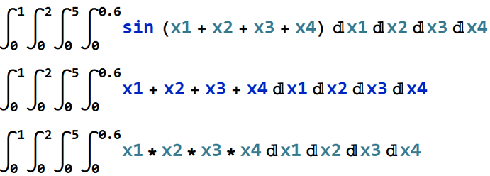

# ZMCintegral


ZMCintegral is a python package which uses Monte Carlo Method to do numerical integrations on Multi-GPU devices. It supports integrations with up to 11 multi-variables. It is capable of even more than 11 variables if time is not of the priori concern. 

# Supports

  - Multi-dimension integration
  - Multi-GPU device


###### To understand how ZMCintegral works, please refer to

### Installation

To run ZMCintegral, the following packages needs to be pre-installed:
  - Tensorflow 1.10+
  - Numpy
  - Math

Installation of ZMCintegral via Anaconda (https://www.anaconda.com) is also supported.
In your specific environment, please use
```sh
$ conda install ZMCintegral
```
to install ZMC integral.

### Basic Example
Integration of the following expression:

```sh
import ZMCintegral
import tensorflow as tf
# user defined function
def my_func(x):
    return tf.sin(x[0]+x[1]+x[2]+x[3])
# obtaining the result
result = ZMCintegral.MCintegral(my_func,[[0,1],[0,2],[0,5],[0,0.6]]).MCresult
# print the formatted result
print('result = %s    std = %s' % (result[0], result[1]))
```
ZMCintegral returns:
```
result = -1.0458884    std = 0.00041554452
```
### Advanced Usage
###### simontaneous evaluation
ZMCintegal supports the evaluation of several integrations simontaneously. For example, the following three:

```sh
import ZMCintegral
import tensorflow as tf
# user defined function
def my_func(x):
    tf.sin(x[0]+x[1]+x[2]+x[3]),x[0]+x[1]+x[2]+x[3],x[0]*x[1]*x[2]*x[3]
# obtaining the result
result = ZMCintegral.MCintegral(my_func,[[0,1],[0,2],[0,5],[0,0.6]]).MCresult
# print the formatted result
print('result = %s    std = %s' % (result[0], result[1]))
```
ZMCintegral returns:
```
result = [-1.0458851 25.799936   2.249969 ]    std = [0.00040938 0.00066065 0.0002065 ]
```

License
----

The package is coded by ZHANG Junjie of University of Science and Technology of China.

**This package is free**
you can redistribute it and/or modify it under the terms of 
the Apache License Version 2.0, January 2004 (http://www.apache.org/licenses/).


[//]: # (These are reference links used in the body of this note and get stripped out when the markdown processor does its job. There is no need to format nicely because it shouldn't be seen. Thanks SO - http://stackoverflow.com/questions/4823468/store-comments-in-markdown-syntax)


   [dill]: <https://github.com/joemccann/dillinger>
   [git-repo-url]: <https://github.com/joemccann/dillinger.git>
   [john gruber]: <http://daringfireball.net>
   [df1]: <http://daringfireball.net/projects/markdown/>
   [markdown-it]: <https://github.com/markdown-it/markdown-it>
   [Ace Editor]: <http://ace.ajax.org>
   [node.js]: <http://nodejs.org>
   [Twitter Bootstrap]: <http://twitter.github.com/bootstrap/>
   [jQuery]: <http://jquery.com>
   [@tjholowaychuk]: <http://twitter.com/tjholowaychuk>
   [express]: <http://expressjs.com>
   [AngularJS]: <http://angularjs.org>
   [Gulp]: <http://gulpjs.com>

   [PlDb]: <https://github.com/joemccann/dillinger/tree/master/plugins/dropbox/README.md>
   [PlGh]: <https://github.com/joemccann/dillinger/tree/master/plugins/github/README.md>
   [PlGd]: <https://github.com/joemccann/dillinger/tree/master/plugins/googledrive/README.md>
   [PlOd]: <https://github.com/joemccann/dillinger/tree/master/plugins/onedrive/README.md>
   [PlMe]: <https://github.com/joemccann/dillinger/tree/master/plugins/medium/README.md>
   [PlGa]: <https://github.com/RahulHP/dillinger/blob/master/plugins/googleanalytics/README.md>
