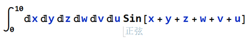
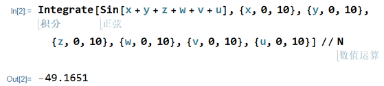

# ZMCintegral

ZMCintegral (Numba backened) is an easy to use python package which uses Monte Carlo Evaluation Method to do numerical integrations on Multi-GPU devices. 
It supports integrations with up to 16 multi-variables, and it is capable of even more than 16 variables if time is not of the priori concern. 

> **To understand how ZMCintegral works, please refer to**

  **https://arxiv.org/pdf/1902.07916v2.pdf**
    
> **This new version supports parameter grid search, for this new functionality please refer to**

  **https://arxiv.org/pdf/1910.01965.pdf**
    
ZMCintegral usually takes a few minutes to finish the task.

##  Newest Features

  - Full flexibility of user defined functions
  - Multi-dimension integration
  - Multi-GPU supports
  - Stratified sampling
  - Heuristic tree search
  - Parameter grid search
  
##  Installation

To run ZMCintegral (Numba-Ray version), the following packages needs to be pre-installed:
  - Numba
  - Ray
  - cudatoolkit
```
# create a new environment
$: conda create -n zmcintegral

# install relavant package
$: conda install numba
$: conda install cudatoolkit (**notification)
$: pip install -U ray[debug]==0.7.1
```
ZMCintegral can be installed simply via
```
$: pip install ZMCintegral
```

** notification

make sure it is compatable with your driver verison, other wise you will get an error:
```
numba.cuda.cudadrv.driver.LinkerError: [218] Call to cuLinkAddData results in UNKNOWN_CUDA_ERROR
ptxas application ptx input, line 9; fatal   : Unsupported .version 6.4; current version is '6.2'
ptxas fatal   : Ptx assembly aborted due to errors
```

#### Prepare for running ZMCintegral
First of all, prepare machines with Nvidia GPU devices. choose one of them as a head node:
```
# for head node
$: ray start --head --redis-port=6789 --num-cpus=10 --num-gpus=4
#for other nodes, here the redis-address is the ip of head node.
$: ray start --redis-address=210.45.78.43:6789 --num-cpus=5 --num-gpus=2
```

Remeber to use
```
# for head node
$: ray stop
#for other nodes
$: ray stop
```
after evaluation.

##  Integration of 6-dimensionals

#### The integration is of the form

 <!-- .element height="20%" width="20%" -->

#### whose result can be obtained via




#### In ZMCintegral this is done via

```
from ZMC.ZMCintegral_normal import MCintegral_normal
import math
import numpy as np

import time
start = time.time()

# user defined function
fun = """ 
import math
# define a device function that should be used by cuda kernel
@cuda.jit(device=True)
def fun(x):
    return math.sin(x[0]+x[1]+x[2]+x[3]+x[4]+x[5]+x[6])
"""

# define arguments that MCintegral_normal requires
depth = 1
sigma_multiplier = 5
num_trials = 5
num_chunks_in_one_dimension = 12

# call MCintegral_normal
MC = MCintegral_normal(my_func = fun, 
                       domain = [[0,10],[0,10],[0,10],[0,10],[0,10],[0,10]], 
                       head_node_address = "210.45.78.19:1234",
                       depth = depth, 
                       sigma_multiplier = sigma_multiplier, 
                       num_trials = num_trials,
                       num_chunks_in_one_dimension = num_chunks_in_one_dimension)


# obtaining the result
result = MC.evaluate()


# print the formatted result
print('result = %s    std = %s' % (result[0], result[1]))
print('evaluation time {}'.format(time.time()-start))
```
#### The output is

```
total number of GPUs:  1
140 hypercube(s) need(s) to be recalculated, to save time, try increasing sigma_multiplier.
result = -49.47563512703137    std = 1.9873890591413763
evaluation time 37.8058066368103
```

##  Integration of 4-dimensionals with parameters

#### The integration is of the form


#### wohse results can be obtained via


#### In ZMCintegral this is done via

```
from ZMC.ZMCintegral_functional import MCintegral_functional
import math
import numpy as np

import time
start = time.time()


# user defined function
fun = """ 
import math
# define a device function that should be used by cuda kernel
@cuda.jit(device=True)
def fun(x,para):
    return math.sin(x[0]+x[1]+x[2]+x[3]+para[0]+para[1])
"""

# para contains two parameters
para = [[1,2,3,4,5],[1.1,2.2,3.1]]


# sample points is taken to 10**6
sample_points = 10**6

# the parameter grid has totally 5*3=15 points
# we choose 3 batches as an example
batch_size = 5

# call MCintegral_functional
MC = MCintegral_functional(my_func = fun, 
                           domain = [[0,1],[0,1],[0,1],[0,1]], 
                           parameters = para, 
                           head_node_address = "210.45.78.19:1234",
                           num_points = sample_points, 
                           batch_size = batch_size)

# obtaining the result
result = MC.evaluate()
result = print(np.reshape(result,[3,5]))
print('evaluation time {}'.format(time.time()-start))

```
#### The output is (which can be conpared with Mathematica's results)
```
<<<<<<<<<<<<<<<<<<<<<<<<<<<<<<<<<<<<<<<<<<<<<<<<<<<<<<<<<
Detected total number of GPUs: 1
Total parameter grid size: 15, Each GPU cycle will cover 5 grid values, Total GPU cycles: 3
Evaluating, please wait...
[[-0.64027657 -0.81054914 -0.23614549  0.55573641  0.83644859]
 [-0.8100885  -0.23610632  0.55550291  0.83625073  0.34960498]
 [-0.23645369  0.55572789  0.83633015  0.34781143 -0.45968675]]
evaluation time 4.728282690048218
```

##  - tuning parameters

The following four parameters can be tuned to fit special cases.

| parameter        | usage           | example           | default  |
|:-------------:|:-------------:|:-------------:|:-----:|
| num_trials     | Evaluate the integration for num_trials times. Better kept within 10. | 10 | 5 |
| depth | For importance sampling. A domain is magnified for depth times. Better kept within 3. |3|2|
| num_chunks_in_one_dimension     | The number of chunks users want to set along one dimension | 10 | 4 |
| sigma_multiplier | Only domains that have very large standardand deviations (hence, very unstable) should be magnified and re-evaluated. Domains which are beyond sigma_multiplication * &sigma; should be recalculated.|3|4|

#### Attention
The user defined function must be organized in string format as shown in the following example. And the function name in the string mutst be `fun`, something like:
```
# user defined function
fun = """ 
import math
# define a device function that should be used by cuda kernel
@cuda.jit(device=True)
def fun(x): # here the function name must be set as `fun`
    return xxx
"""
```

##  More Help

**One should read the [documentation](https://numba.pydata.org/numba-doc/dev/cuda/index.html) for the Numba package's CUDA capabilities when trying to use this package.** ZMCintegral is only compatible with device functions as Numba does not support dynamic parallelism. This is important when designing the integrated function.

Issues with CUDA should first be resolved by looking at the [CUDA documentation](https://docs.nvidia.com/cuda/index.html).

For further questions and technical issues, please contact us at

whz168@mail.ustc.edu.cn (Hong-Zhong Wu 伍宏忠)

zjacob@mail.ustc.edu.cn (Jun-Jie Zhang 张俊杰)


##  License
----

The package is coded by Jun-Jie Zhang and checked by Hong-Zhong Wu of University of Science and Technology of China.

**This package is free**
you can redistribute it and/or modify it under the terms of 
the Apache License Version 2.0, January 2004 (http://www.apache.org/licenses/).

**File Structure**
```
ZMCintegral
│   README.md 
│   LICENSE
│   setup.py 
│
└───ZMC
│   │   ZMCintegral_functional.py
│   │   ZMCintegral_normal.py
│   │   __init__.py
│
└───pics
    │   sin6d.PNG 
    │   sin6d_theoretical.PNG 
	│   parameter integration.PNG
	│   parameter integration theoretical.PNG
```

[//]: # (These are reference links used in the body of this note and get stripped out when the markdown processor does its job. There is no need to format nicely because it shouldn't be seen. Thanks SO - http://stackoverflow.com/questions/4823468/store-comments-in-markdown-syntax)


   [dill]: <https://github.com/joemccann/dillinger>
   [git-repo-url]: <https://github.com/joemccann/dillinger.git>
   [john gruber]: <http://daringfireball.net>
   [df1]: <http://daringfireball.net/projects/markdown/>
   [markdown-it]: <https://github.com/markdown-it/markdown-it>
   [Ace Editor]: <http://ace.ajax.org>
   [node.js]: <http://nodejs.org>
   [Twitter Bootstrap]: <http://twitter.github.com/bootstrap/>
   [jQuery]: <http://jquery.com>
   [@tjholowaychuk]: <http://twitter.com/tjholowaychuk>
   [express]: <http://expressjs.com>
   [AngularJS]: <http://angularjs.org>
   [Gulp]: <http://gulpjs.com>

   [PlDb]: <https://github.com/joemccann/dillinger/tree/master/plugins/dropbox/README.md>
   [PlGh]: <https://github.com/joemccann/dillinger/tree/master/plugins/github/README.md>
   [PlGd]: <https://github.com/joemccann/dillinger/tree/master/plugins/googledrive/README.md>
   [PlOd]: <https://github.com/joemccann/dillinger/tree/master/plugins/onedrive/README.md>
   [PlMe]: <https://github.com/joemccann/dillinger/tree/master/plugins/medium/README.md>
   [PlGa]: <https://github.com/RahulHP/dillinger/blob/master/plugins/googleanalytics/README.md>
