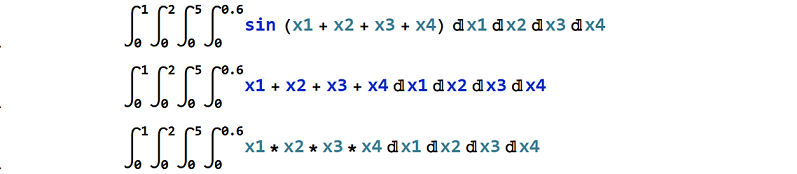

# ZMCintegral


ZMCintegral is an easy to use python package which supports Monte Carlo and Average Evaluation Method  to do numerical integrations on Multi-GPU devices. 
It supports integrations with up to 11 multi-variables. It is capable of even more than 11 variables if time is not of the priori concern. It usually takes a few minutes to finish the task.

# Supports

  - Multi-dimension integration
  - Multi-GPU device
  - Importance sampling
  - Heuristic tree search
  - Choosing from different methods


###### To understand how ZMCintegral works, please refer to ????????????????????????

### Installation

To run ZMCintegral, the following packages needs to be pre-installed:
  - Tensorflow 1.10
  - Numpy
  - Math

Installation of ZMCintegral via Anaconda (https://www.anaconda.com) is also supported.
In your specific environment, please use

```sh
$ conda install -c zhang-junjie zmcintegral
```
to install ZMC integral, and make sure you have tensorflow-gpu 1.10 installed.

### Basic Example
Integration of the following expression:


```sh
import tensorflow as tf
from ZMCintegral import ZMCintegral

# user defined function
def my_func(x):
    return tf.sin(x[0]+x[1]+x[2]+x[3])

MC = ZMCintegral.MCintegral(my_func,[[0,1],[0,2],[0,5],[0,0.6]])

# obtaining the result
result = MC.evaluate()

# print the formatted result
print('result = %s    std = %s' % (result[0], result[1]))
```
ZMCintegral returns:

```sh
result = -1.0458884    std = 0.00041554452
```

### Advanced Usage
#### simontaneous evaluation
ZMCintegal supports the evaluation of several integrations simontaneously. For example, the following three:


```sh
from ZMCintegral import ZMCintegral
import tensorflow as tf

# user defined function
def my_func(x):
    return tf.sin(x[0]+x[1]+x[2]+x[3]),x[0]+x[1]+x[2]+x[3],x[0]*x[1]*x[2]*x[3]
    
# obtaining the result
result = ZMCintegral.MCintegral(my_func,[[0,1],[0,2],[0,5],[0,0.6]]).evaluate()

# print the formatted result
print('result = %s    std = %s' % (result[0], result[1]))
```

ZMCintegral returns:

```sh
result = [-1.0458851 25.799936   2.249969 ]    std = [0.00040938 0.00066065 0.0002065 ]
```

#### tuning parameters

The following four parameters can be tuned to fit special cases.

| parameter        | usage           | example           | default  |
|:-------------:|:-------------:|:-------------:|:-----:|
| available_GPU    | Specify gpu used in calculation. | [0,1] | ALL GPUs detected |
| num_trials     | Evaluate the integration for num_trials times. Better kept within 10. | 10 | 5 |
| depth | For importance sampling. A domain is magnified for depth times. Better kept within 5. |3|2| 
| sigma_multiplication | For importance sampling. Only domains that have very large standardand deviations (hence, very unstable) should be magnified and re-evaluated. Domains which are beyond sigma_multiplication * &sigma; should be recalculated.|3|4|

IF the integration is pretty normal, the default configuration is recomanded.

IF the integration is really sharped, one can try increasing depth or decreasing sigma_multiplication.

IF the resulted std is too large, one can try increasing num_trials.

#### For periodic integrands with many periods, one is recomanded to set [sigma_multiplication ~ -2] OR [a larger chunk_size_multiplier and smaller chunk_size_x]. 
#### For high peak integrands, one is recomanded to set [sigma_multiplication ~ +3.5] OR [a larger chunk_size_multiplier and smaller chunk_size_x]. 
#### The resons for these tips can be found here ??????????????

###### example

```sh
ZMCintegral.MCintegral(my_func,[[0,1],[0,2],[0,5],[0,0.6]],
available_GPU=[0,1],num_trials=3,depth=3,sigma_multiplication=3).evaluate()
```

#### sampling points reconfiguration

ZMCintegral configures the sampling points automatically, 
but it also provides user-reconfigure of sampling points, eg:

```sh
import tensorflow as tf
from ZMCintegral import ZMCintegral

# user defined function
def my_func(x):
    return tf.sin(x[0]+x[1]+x[2]+x[3])

MC = ZMCintegral.MCintegral(my_func,[[0,1],[0,2],[0,5],[0,0.6]])

#############################################################################################
# sampling points reconfiguration
# total sampling points is equal to (chunk_size_x*chunk_size_multiplier)**dim, which is huge.
MC.chunk_size_x = 30
MC.chunk_size_multiplier = 3
#############################################################################################

# obtaining the result
result = MC.evaluate()

# print the formatted result
print('result = %s    std = %s' % (result[0], result[1]))
```
#### Tip: when to change chunk_size_x?
One can monitor the gpu utilization rate when eavalutaing the integration. If the utilization rate is really small, then one needs to consider increasing chunk_size_x at a cost of consuming more time resources.

#### For periodic integrands with many periods, one is recomanded to set [sigma_multiplication ~ -2] OR [a larger chunk_size_multiplier and smaller chunk_size_x]. 
#### For high peak integrands, one is recomanded to set [sigma_multiplication ~ +3.5] OR [a larger chunk_size_multiplier and smaller chunk_size_x]. 
#### The resons for these tips can be found here ??????????????

#### choosing other integration method
ZMCintegral supports the integration of other methods as well. Now it supports 'AdaptiveImportanceMC' and 'AverageDigging'.
This method is especially stable for very rapid fluctuation integrands.
###### example

```sh
# user defined function
def my_func(x):
    return tf.sin(x[0])

MC = ZMCintegral.MCintegral(my_func,[[0,10]],method='AverageDigging')
MC.chunk_size_x=30

# obtaining the result
result = MC.evaluate()

# print the formatted result
print('result = %s    std = %s' % (result[0], result[1]))
```


License
----

The package is coded by ZHANG Junjie and checked by WU Hongzhong of University of Science and Technology of China.

**This package is free**
you can redistribute it and/or modify it under the terms of 
the Apache License Version 2.0, January 2004 (http://www.apache.org/licenses/).


[//]: # (These are reference links used in the body of this note and get stripped out when the markdown processor does its job. There is no need to format nicely because it shouldn't be seen. Thanks SO - http://stackoverflow.com/questions/4823468/store-comments-in-markdown-syntax)


   [dill]: <https://github.com/joemccann/dillinger>
   [git-repo-url]: <https://github.com/joemccann/dillinger.git>
   [john gruber]: <http://daringfireball.net>
   [df1]: <http://daringfireball.net/projects/markdown/>
   [markdown-it]: <https://github.com/markdown-it/markdown-it>
   [Ace Editor]: <http://ace.ajax.org>
   [node.js]: <http://nodejs.org>
   [Twitter Bootstrap]: <http://twitter.github.com/bootstrap/>
   [jQuery]: <http://jquery.com>
   [@tjholowaychuk]: <http://twitter.com/tjholowaychuk>
   [express]: <http://expressjs.com>
   [AngularJS]: <http://angularjs.org>
   [Gulp]: <http://gulpjs.com>

   [PlDb]: <https://github.com/joemccann/dillinger/tree/master/plugins/dropbox/README.md>
   [PlGh]: <https://github.com/joemccann/dillinger/tree/master/plugins/github/README.md>
   [PlGd]: <https://github.com/joemccann/dillinger/tree/master/plugins/googledrive/README.md>
   [PlOd]: <https://github.com/joemccann/dillinger/tree/master/plugins/onedrive/README.md>
   [PlMe]: <https://github.com/joemccann/dillinger/tree/master/plugins/medium/README.md>
   [PlGa]: <https://github.com/RahulHP/dillinger/blob/master/plugins/googleanalytics/README.md>
